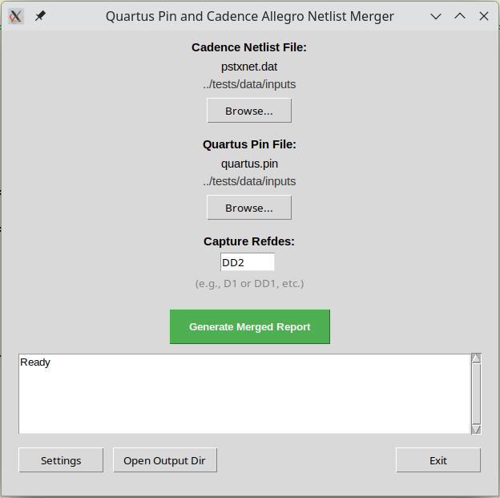

# Quartus Cadence Netlist Merger

[](https://www.python.org/)
[](https://opensource.org/licenses/MIT)
[](https://github.com/yuravg/quartus_cadence_netlist_merger/releases)

Merge Quartus Prime pin files with Cadence Allegro netlists. Easy-to-use GUI interface.

## Overview

This tool merges Intel Quartus Prime Pin files (*.pin) with Cadence PCB Editor (Allegro)
Netlists (pstxnet.dat), mapping Cadence net/pin names to Quartus pin information.
This tool may be useful for Quartus Prime FPGA developers working with Cadence Allegro designs.

### Example

**Input: Quartus pin file**
```
Pin Name/Usage               : Location  : Dir.   : I/O Standard      : Voltage : I/O Bank  : User Assignment
-------------------------------------------------------------------------------------------------------------
GND+                         : AA11      :        :                   :         : 3         :
f333                         : AA12      : input  : LVDS              :         : 4         : Y
data1_rx[4]                  : AA13      : input  : LVDS              :         : 4         : Y
```

**Output: Merged file with Cadence net names**
```
Net Name (Capture):  Pin Name/Usage               : Location  : Dir.   : I/O Standard      : Voltage : I/O Bank  : User Assignment
-------------------------------------------------------------------------------------------------------------
GND                  GND+                         : AA11      :        :                   :         : 3         :
F333P                f333                         : AA12      : input  : LVDS              :         : 4         : Y
DATA1P4              data1_rx[4]                  : AA13      : input  : LVDS              :         : 4         : Y
```

## Features

- **Easy-to-use GUI** - Simple interface for file selection and configuration
- **Automatic backups** - Preserves up to 100 versions of output files
- **Configurable mapping** - Reference designator selection and pin name transformations
- **Cross-platform** - Works on Linux and Windows with Python 3.10+
- **Zero dependencies** - Uses only Python standard library
- **Modern Python** - Uses f-strings, pathlib, and type hints for maintainable code

## Requirements

- **Python 3.10 or later**
- Tkinter (included with most Python installations)

## Installation

### Option 1: Install from Release

1. Download the latest `.whl` file from [Releases](https://github.com/yuravg/quartus_cadence_netlist_merger/releases)

2. Install using pip:
```bash
pip install quartus_cadence_netlist_merger-<version>.whl
```

### Option 2: Build from Source

```bash
git clone https://github.com/yuravg/quartus_cadence_netlist_merger.git
cd quartus_cadence_netlist_merger
make build
make install
```

### Verify Installation

```bash
qp_cnl_merger --version
```

## Usage

Launch the GUI:
```bash
qp_cnl_merger
```

Steps:
1. Select Quartus pin file (*.pin)
2. Select Cadence netlist file (pstxnet.dat)
3. Configure reference designator if needed
4. Click "Generate Merged Report" to generate merged output




## Development

Build and test:
```bash
make build          # Build wheel package
make install        # Install package
make pytest         # Run all tests (47 tests)
make coverage       # Run tests with coverage report
make lint           # Run linters (ruff + mypy)
make format         # Format code with black
make quality        # Run format + lint + tests
make clean          # Clean build artifacts
make help           # Show all available commands
```

### Development Setup

```bash
# Create virtual environment and install dev dependencies
make venv-dev

# Run quality checks
make quality        # Format, lint, and test

# Or run individually
make format         # Format with black
make ruff           # Lint with ruff
make mypy           # Type check with mypy
make pytest         # Run all tests
```

## License

This project is licensed under the MIT License.
